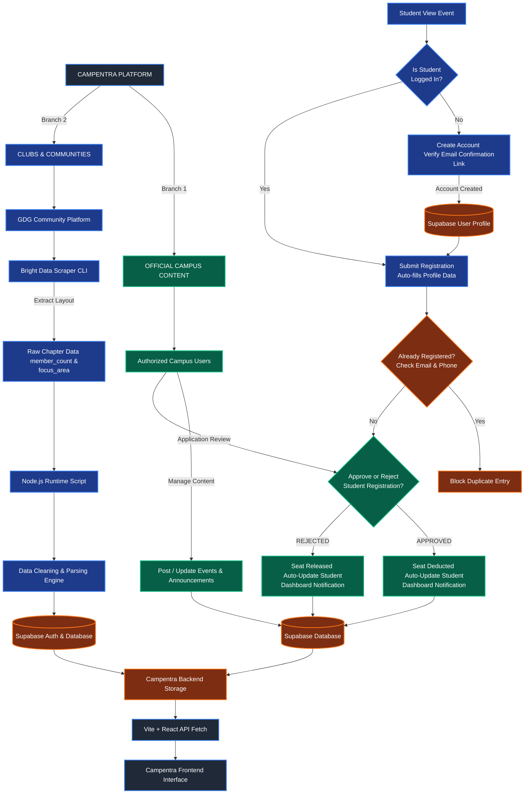

# Campentra

Campentra is a student-focused campus discovery platform built for the **Into The Scrape-Verse** hackathon in collaboration with **Bright Data**.

## What Campentra does

Campentra combines two complementary sources of campus information:

1. **Verified campus content** — authorized campus users can publish official events, announcements, and manage student registrations.
2. **Web discovery** — Bright Data Scraper Studio collects publicly available campus/event information, normalizes it, and stores it in Supabase for discovery inside Campentra.

The long-term goal is to give students one place to discover what is happening across campuses instead of searching many disconnected websites.

## Current stack

- React + Vite
- Supabase Auth + PostgreSQL
- Bright Data Scraper Studio
- JavaScript / Node.js

## Bright Data pipeline

```text
Public campus/event websites
        ↓
Bright Data Scraper Studio
        ↓
Structured scraper output
        ↓
Campentra normalization
        ↓
Supabase `campus_listings`
        ↓
Campentra discovery UI
```

The current collector is documented in `.cursor/rules/brightdata.mdc`.

## Local development

```bash
npm install
npm run dev
```

Production build:

```bash
npm run build
```

Bright Data collection:

```bash
npm run collect:campus-listings
```

## Environment variables

Create a local `.env.local` file. Never commit it.

```env
VITE_SUPABASE_URL=
VITE_SUPABASE_PUBLISHABLE_KEY=
BRIGHT_DATA_COLLECTOR_ID=
```

The collector script also supports server-side `SUPABASE_SERVICE_ROLE_KEY` for database ingestion. Keep that key server-side only.

## Security

- Use public web sources only.
- Never commit API keys or Supabase service-role credentials.
- Keep RLS enabled on user-facing Supabase tables.
- Do not expose service-role credentials in the browser.
